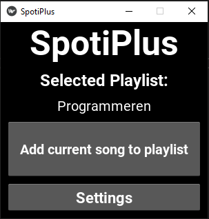
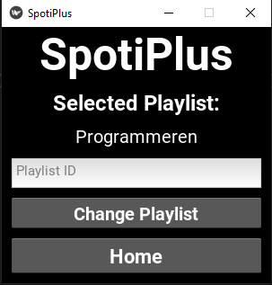

# Spotiplus
Program which lets the user add the current song to a preset playlist instantly by clicking one button.

# What i learned
I learned quite a lot about the spotipy API and KIVY. Also about things like access tokens and authorization flow.

# Usage
1. Replace USER with your username, CLIENT_ID with your client id and CLIENT_SECRET with your client secret in Config.py
2. Go to the settings tab in the program and insert and set a playlist id / uri. (can be found by spotify playlist > share > copy spotify URI)
3. Press the add song button when you want to add the currently playing song!

